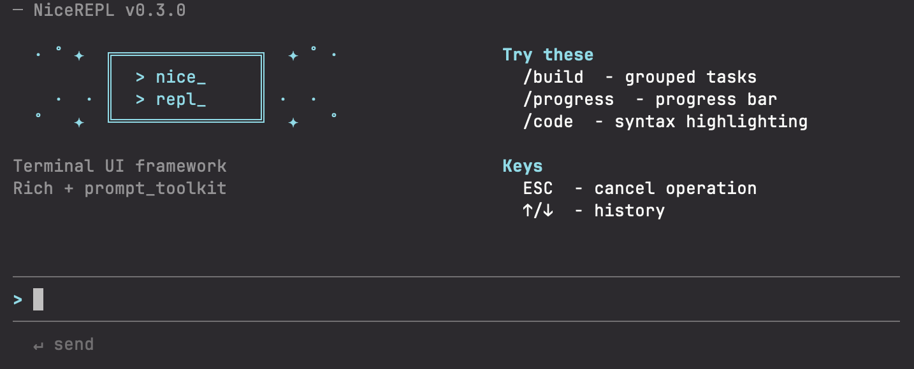
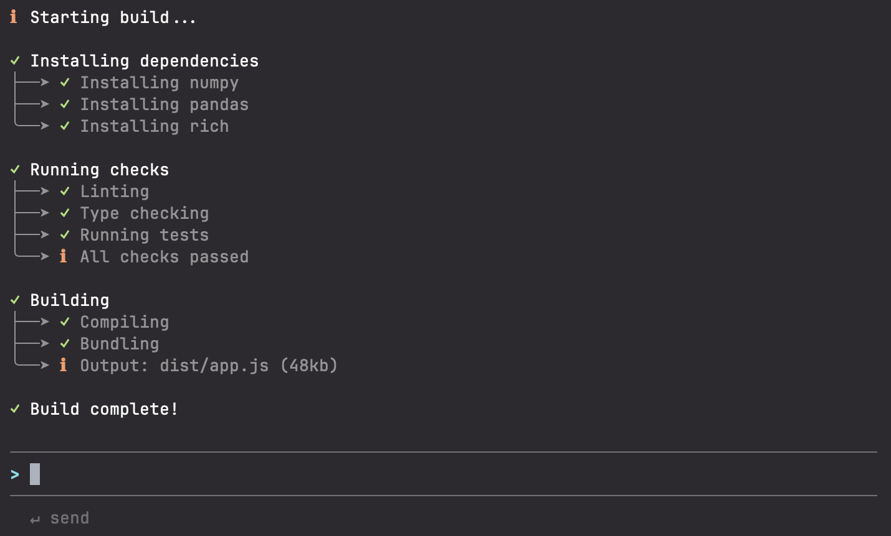
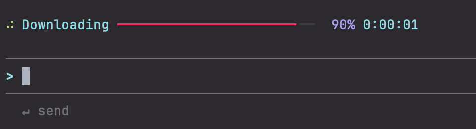
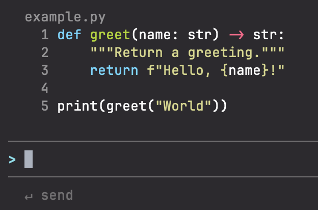
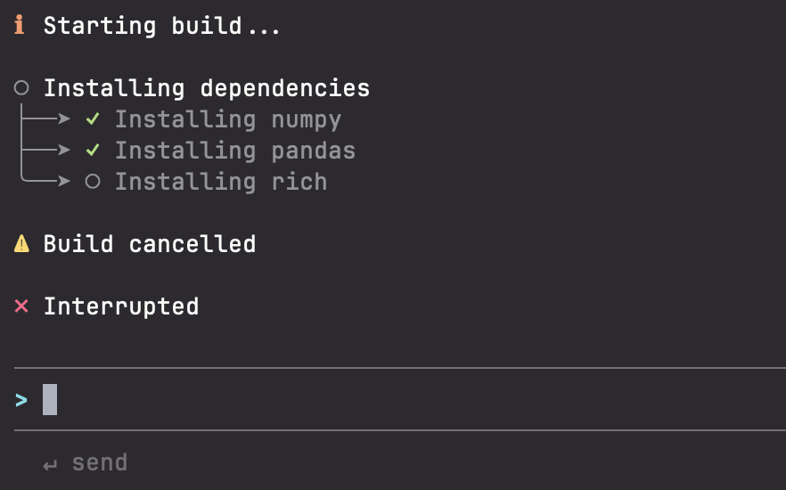

# NiceREPL

A terminal REPL framework built on Rich and prompt_toolkit.




## Quick Start

```python
import asyncio
from nicerepl import repl, ui

@repl.on_input
async def handle(text: str):
    ui.echo(text)
    with ui.status("Working..."):
        await asyncio.sleep(1)
    ui.success("Done")

@repl.command("/quit")
async def quit_cmd(args: str):
    repl.exit()

repl.run()
```

## Features

### Grouped Tasks

Nested task groups with status indicators.



```python
with ui.group("Installing") as g:
    with g.task("numpy"):
        await install("numpy")
    with g.task("pandas"):
        await install("pandas")
    await g.info("Installed 2 packages")
```

### Progress Bars

Progress tracking with time estimates.



```python
with ui.progress("Downloading", total=100, show_time=True) as p:
    for chunk in chunks:
        download(chunk)
        p.advance(1)
```

### Code Blocks

Syntax-highlighted code with titles.



```python
ui.code("print('hello')", language="python", title="example.py")
```

### Cancellation

Press ESC to cancel operations. Handlers receive `asyncio.CancelledError`.



```python
async with ui.cancelable() as scope:
    try:
        await scope.sleep(10)
    except asyncio.CancelledError:
        ui.warning("Cancelled")
        raise
```

## API Reference

### REPL

```python
@repl.on_start      # Called once at startup
@repl.on_input      # Called for non-command input
@repl.on_error      # Called when handlers raise
@repl.command("/x") # Register slash command

repl.prompt = ">>> "
repl.exit()
repl.run()
```

### UI Output

```python
ui.print("Rich [bold]markup[/bold]")
ui.echo("Echo user input")
ui.success("Success")
ui.error("Error")
ui.warning("Warning")
ui.info("Info")
ui.code(code, language="python")
ui.markdown("# Heading")
```

### Context Managers

```python
with ui.status("Loading...") as s:
    s.update("Still loading...")

with ui.progress("Task", total=N) as p:
    p.advance(1)

with ui.stream() as s:
    s.write("streaming text")

with ui.group("Title") as g:
    with g.task("Subtask"):
        pass
    await g.info("Note")

async with ui.cancelable() as scope:
    await scope.sleep(1)
    for item in scope.iter(items):
        pass

if await ui.confirm("Proceed?"):
    pass
```

### Cancellation Helpers

```python
from nicerepl import check_cancelled

async with ui.cancelable() as scope:
    await scope.sleep(n)           # Interruptible sleep
    await scope.checkpoint()       # Yield point
    for x in scope.iter(items):    # Sync iteration
        pass
    async for x in scope.aiter(items):  # Async iteration
        pass

    # Tight loops
    for i in range(1000000):
        if i % 1000 == 0:
            check_cancelled()
```

## Key Bindings

| Key | Action |
|-----|--------|
| Enter | Submit |
| Shift+Enter | Newline |
| ESC | Cancel operation |
| Ctrl+C | Cancel / clear |
| Ctrl+D | Exit |
| Up/Down | History |

## Terminal Setup

For Shift+Enter support:

**Ghostty**: `keybind = shift+enter=text:\n`

**iTerm2**: Preferences → Profiles → Keys → Add Shift+Enter → Send Text `\n`

**VS Code**: Add to keybindings.json:
```json
{"key": "shift+enter", "command": "workbench.action.terminal.sendSequence", "args": {"text": "\n"}, "when": "terminalFocus"}
```

## License

MIT
